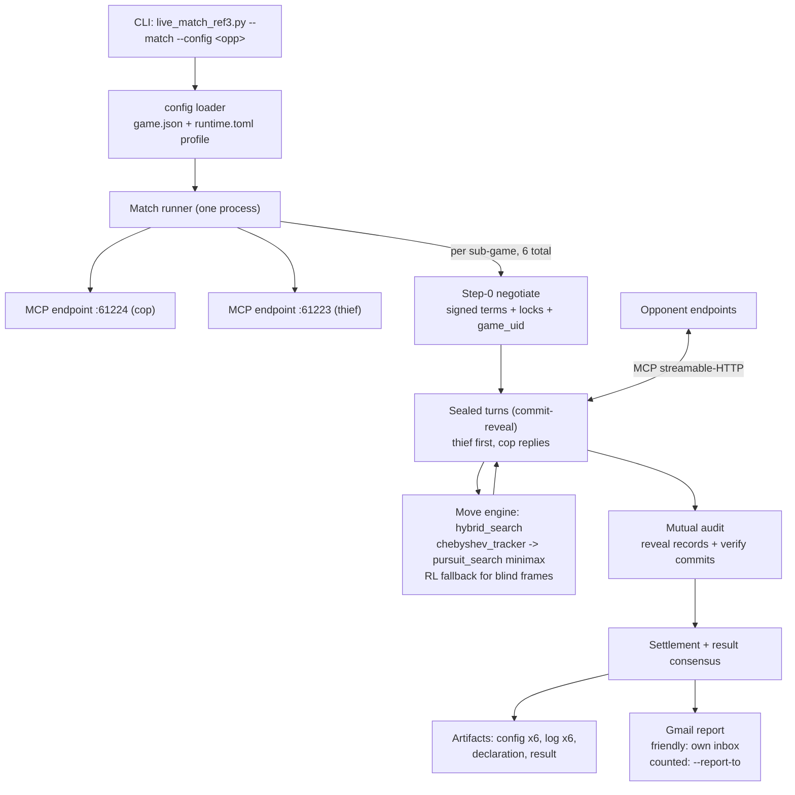

# vibecode-cop — Cop/Thief League Agent (Cop side)

Autonomous cop agent for the university Cop/Thief P2P league. It plays complete
six-sub-game series against remote opponents over the **reference-v3 MCP wire**
(commit-reveal sealed turns, bilateral audit), moves with a **minimax search over
exact scent tracking** with a trained RL fallback, and reports results by Gmail.

Companion repository: [vibecode-thief](https://github.com/AmitKuper/vibecode-thief)
(the thief-side model and mirror implementation). The two repos are operated as one
distributed product; this repo hosts the match runner that serves both endpoints.

**Match record**: counted series vs `imreeyal` **won 90–30** (6/6 mutual audits
Verified OK; evidence in `evidence/game_vs_imreeyal/`), after a friendly rehearsal
also won 90–30. An earlier counted series vs `anrbj666` was lost 35–75 with the
previous pure-RL engine (`evidence/game_vs_anrbj666/`).

## Prerequisites

- **Python 3.13** (pinned in `.python-version`; `pyproject.toml` requires >= 3.12)
- **[uv](https://docs.astral.sh/uv/)** — package and environment manager
- The unmodified league interop kit cloned as a **sibling** of this repo:
  `../external/copthief-league-protocol`
- Optional: a local [Ollama](https://ollama.com) with `llama3.1:8b` for
  LLM-generated hint text (templates are the automatic fallback — nothing breaks
  without it)

## Installation

### Windows (primary development platform)

```powershell
# 1. Install uv
powershell -ExecutionPolicy ByPass -c "irm https://astral.sh/uv/install.ps1 | iex"

# 2. Clone this repo and the league kit side by side
git clone https://github.com/AmitKuper/vibecode-cop
mkdir external
git clone https://github.com/Imreec/copthief-league-protocol external/copthief-league-protocol

# 3. Install dependencies (uv installs the pinned Python automatically)
cd vibecode-cop
uv sync --frozen
```

### macOS / Linux

Identical flow; only the uv installer differs:

```bash
curl -LsSf https://astral.sh/uv/install.sh | sh
git clone https://github.com/AmitKuper/vibecode-cop
mkdir external && git clone https://github.com/Imreec/copthief-league-protocol external/copthief-league-protocol
cd vibecode-cop && uv sync --frozen
```

### Verify the install

```bash
uv run pytest tests/ cop_worker/tests/ league_manager/tests/ -q
```

Expected: ~1,478 tests pass (the same suite CI gates, with branch coverage >= 80%).

## Quick start — self-test against the bundled sparring peer

No network or opponent needed; this plays our agent against the league kit's own
sparring peer over real local HTTP:

```bash
python scripts/live_match_ref3.py --self-test --role thief --sub-games 2
```

Swap `--role police` to exercise the cop side. Each sub-game ends with a mutual
commit-reveal audit; the run prints the per-sub-game outcome and audit verdict.

## Usage

### Playing a live match

```bash
# Friendly series against a saved opponent profile
python scripts/live_match_ref3.py --match --config imreeyal

# Counted series: the lecturer/league address is passed BY HAND, never stored
python scripts/live_match_ref3.py --match --config imreeyal --counted \
    --report-to <league-address>
```

What `--match` does, end to end:

1. Serves our two MCP endpoints — **cop on port 61224, thief on port 61223**
   (static public IP, router port-forwarded; no tunnel).
2. Dials the opponent's endpoints per sub-game (our cop dials their thief and
   vice versa), with per-call 10 s caps and at-least-once retries.
3. Plays exactly **six sub-games** over the reference-v3 wire: signed Step-0
   negotiation, thief-first sealed turns (commit-reveal), mutual audit,
   settlement.
4. Writes four artifact kinds per series: per-sub-game `config_*` and `log_*`,
   plus one `declaration_*` and one `result_*` (league schema, `artifacts/`),
   and a timestamped match log under `reports/ref3_matches/`.
5. Emails the result. Friendly default: **our own inbox**. Counted: the address
   given via `--report-to` — it is never stored in any config file
   (enforced by `tests/test_config_single_source.py::test_runtime_toml_has_no_league_address`).

Useful flags: `--role`, `--sub-games`, `--scent-model`, `--move-policy
{rl,hybrid_search}`, `--no-email`, `--opp-cop-url`/`--opp-thief-url` (override the
profile), `--counted-played`.

### Checking match status

The workspace ships a Claude Code skill, `../.claude/skills/game-status`, that parses
`reports/ref3_matches/match_*.log` and the artifacts and answers "did the game
start / who is winning / was the report sent". Manually, the same information is
in `reports/ref3_matches/last_match_result.json` and `artifacts/`.

### Arena and evaluation scripts

```bash
# Search engine vs trained checkpoints (promotion evidence for hybrid_search)
python scripts/arena_search_eval.py --games 20 --cop search --thief search --depth 3

# Adversarial archetype sweep (wall-cutter cop, parity dodger, claim-fork cop)
python scripts/arena_archetypes.py

# Champion evaluation harness
python scripts/eval_candidate.py --help
```

## Configuration

Full details in [`config/README.md`](config/README.md). The one distinction that
matters:

| File | Role | Hashed/shared? |
|---|---|---|
| `config/game.json` | **Shared constitution** — every game rule (board, scent physics, scoring, movement, league terms). Its whole-file canonical SHA (`config_sha256`) and the derived `game_uid` are exchanged with the opponent and must match. | Yes |
| `config/runtime.toml` | **Private operations** — network endpoints/ports, timeouts, LLM settings, identity, report recipient. Changes how we run, never the rules. | Never |

### Opponent profiles

`config/opponents/<group>/{game.json, runtime.toml}` — selected with
`--config <group>`, falling back to the base `config/` if no profile exists.
After each match the effective config is saved back to the profile. CLI flags
always override profile values.

### Scent model per pairing

The negotiated scent law is set per opponent in
`config/opponents/<opp>/runtime.toml` under `[protocol] scent_model`
(or `--scent-model`). Two registered models, each with a locked doc hash
(`cop_worker/protocol/reference_v3.py::SCENT_LOCKS`):

- `multiplicative_book_v1` (`934c220d…`)
- `subtractive_chebyshev_v1` (`81ebee59…`) — used vs imreeyal; makes the
  transmitted frame a position oracle (see `docs/PRD_search_engine.md`)

### Environment switches (training/serving observation modes)

Defined in `cop_worker/rl/obs_mode.py`; all default OFF:

| Variable | Effect |
|---|---|
| `COPTHIEF_SCENT_MODEL` | Which scent physics our emission/training uses (`book`/`chebyshev` shorthands accepted) |
| `COPTHIEF_UNIFORM_BELIEF=1` | Train with the frozen uniform belief production actually feeds |
| `COPTHIEF_WIRE_SCENT=1` | Train with the clamped wire scent law instead of the unclamped trainer field |
| `COPTHIEF_DECODED_SCENT=1` | Invert the clamped wire law into an emitter posterior (requires wire scent) |

A serving guard (`cop_worker/rl/counted_policy.py`) compares these against the
promoted model's `obs_mode` block in `models/MANIFEST.json` and **refuses to load**
on mismatch — a checkpoint can never be served under physics it was not trained on.

## Architecture



Design authority: [`docs/DESIGN.md`](docs/DESIGN.md) (C4 diagrams, sub-game
sequence, numbered architecture decisions).

### Match visuals

Rendered from a real rule-46/47 game between the shipped `hybrid_search` policies
(`python scripts/render_match_visuals.py` regenerates them):

| Trajectory | Chebyshev scent (wire snapshot) | Search territory eval |
|---|---|---|
|  |  |  |

## Module reference

| Path | Purpose |
|---|---|
| `scripts/live_match_ref3.py` | Match orchestrator and CLI entry point (self-test + live match) |
| `scripts/ref3_artifacts.py` | League-schema artifact emission, `config_sha256` |
| `cop_worker/protocol/reference_v3.py` | Reference-v3 wire: canonical JSON, commits, terms, locks, session |
| `cop_worker/protocol/protocol_agent.py` | Pre-game LLM protocol-understanding agent (never in-game) |
| `cop_worker/rl/pursuit_search.py` | Depth-limited minimax with territory evaluation (both roles) |
| `cop_worker/rl/search_policy.py` | Serving adapter: minimax first, RL fallback |
| `cop_worker/rl/chebyshev_tracker.py` | Exact opponent cell from a chebyshev frame (0.8-peak oracle) |
| `cop_worker/scent_chebyshev.py` | Byte-exact `subtractive_chebyshev_v1` emission/decay/trail |
| `cop_worker/rl/counted_policy.py` | Champion loader + obs-mode serving guard |
| `cop_worker/rl/obs_mode.py` | The `COPTHIEF_*` observation-mode switches |
| `cop_worker/observation.py` | `LocalObservation` / `BeliefState` (no hidden coordinates) |
| `cop_worker/language/` | Hint generation: deception policy, LLM hints, templates |
| `cop_worker/gmail/gatekeeper.py` | Rate-limited, circuit-broken Gmail send pipeline |
| `league_manager/` | Routing facade: router, series lifecycle, ledger, admin API, Gmail gatekeeper |
| `models/MANIFEST.json` | Promoted champion registry (SHA-pinned, obs-mode-stamped) |

The legacy `agent/` tree is **dead** (nothing imports it) and is scheduled for
deletion — do not build on it.

## Project structure

```
vibecode-cop/
├── scripts/            # match runner, arenas, evaluation, Gmail setup
├── cop_worker/         # the cop worker: protocol, RL, language, gmail, MCP server
├── league_manager/     # routing facade + reporting
├── config/             # game.json (shared) + runtime.toml (private) + opponents/
├── models/             # trained checkpoints + MANIFEST.json
├── tests/              # cross-package suites (plus per-package tests/)
├── artifacts/          # league-schema per-game outputs
├── reports/            # timestamped match logs + result snapshots
├── evidence/           # played-series evidence (do not modify)
└── docs/               # DESIGN, PRDs, PROMPTS, runbooks
```

## Troubleshooting

The full log-signature playbook (what each wire error means and the exact sentence
to send the other team) is [`../docs/MATCH_DIAGNOSIS_PLAYBOOK.md`](../docs/MATCH_DIAGNOSIS_PLAYBOOK.md).
The rows that matter most:

| Symptom | Meaning / fix |
|---|---|
| Probe answers **406** | Opponent endpoint healthy (MCP refusing a bare GET) — this is the READY state |
| Probe answers **502/530** | Their edge is up but nothing is bound behind it — they must restart their peer/tunnel |
| Port preflight refusal at start | A stray local process holds 61223/61224 — kill it |
| Obs-mode guard refusal at load | `COPTHIEF_*` env contradicts the manifest — fix the env, never override the guard |
| Zero turns after handshake | Opponent posting to the wrong role port: cop turns go to our **thief** endpoint (:61223), thief turns to our **cop** endpoint (:61224) |
| Barriers behaving impossibly | Cell-convention mismatch — wire cells are `[row, col]`, not `[x, y]` |
| `REPORT WITHHELD` | Fewer than 6 settled sub-games — correct behaviour (rule 35), settle the missing windows |

Every match line is wall-clock stamped in `reports/ref3_matches/match_*.log`;
diagnose from `[wire<-]` and `[diag]` lines, not guesswork.

## Contributing

1. Fork, create a feature branch, open a PR.
2. Gates that must pass (same as CI): `uv run ruff check .`,
   `uv run ruff format --check .`, and the full pytest suite with branch
   coverage >= 80%.
3. Aspire to <= 150 lines per module (project rule; existing oversized modules
   are recorded as an accepted deviation in `docs/KNOWN_DEVIATIONS.md`).
4. Never edit `evidence/`, `config/game.json` hashes, or the external kit.

## License and credits

MIT — see [`LICENSE`](LICENSE).

- **Authors**: Ron Marom, Amit Kuperminz (group *vibecode*)
- **Course**: AI Agent Orchestration, by Dr. Segal Yoram
- **League interop kit**: [`copthief-league-protocol`](https://github.com/Imreec/copthief-league-protocol)
  by the imreeyal team (used unmodified)
