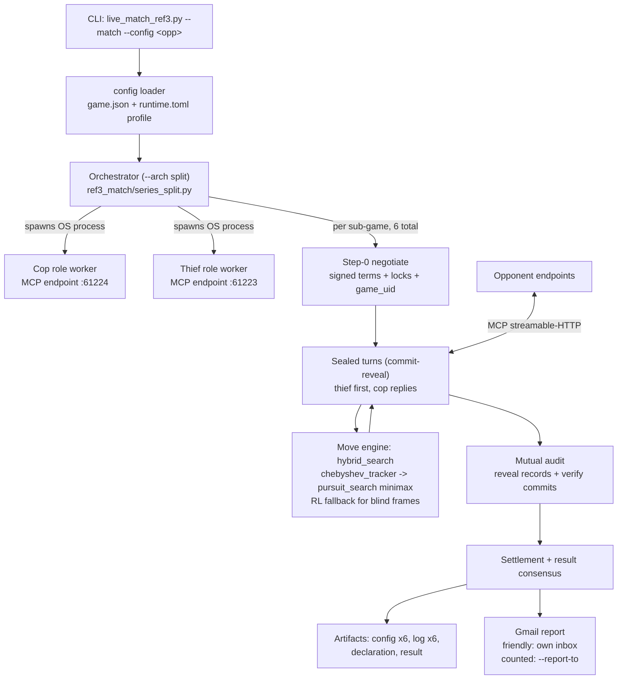
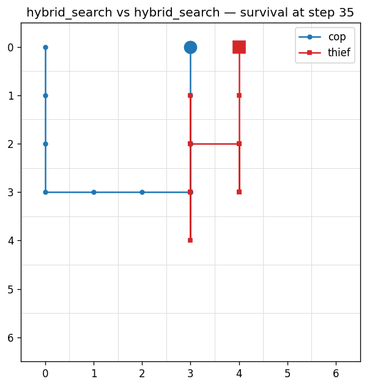
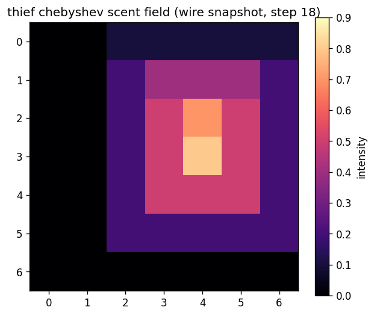
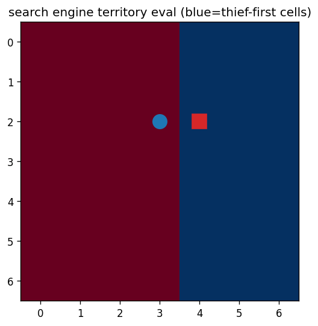
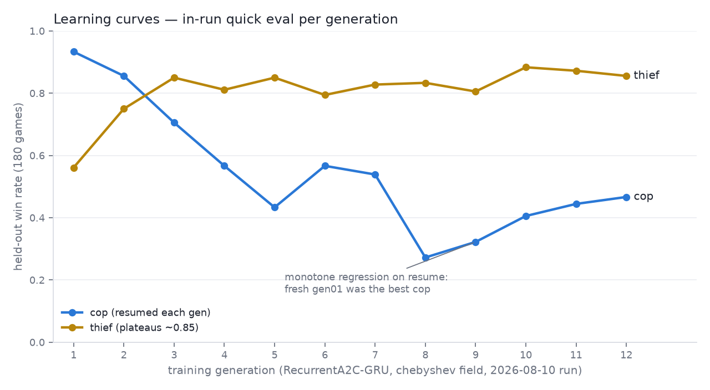
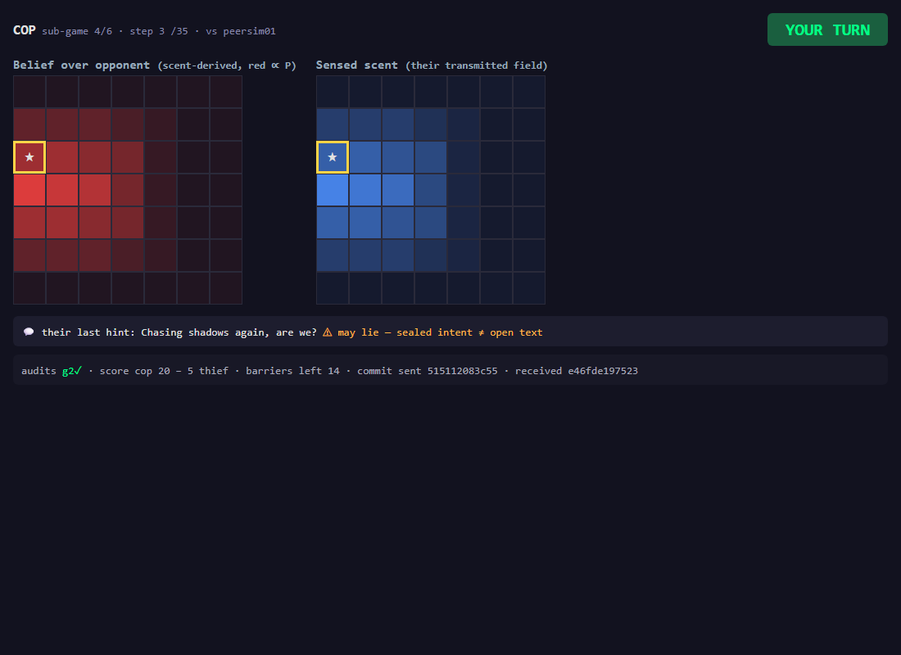
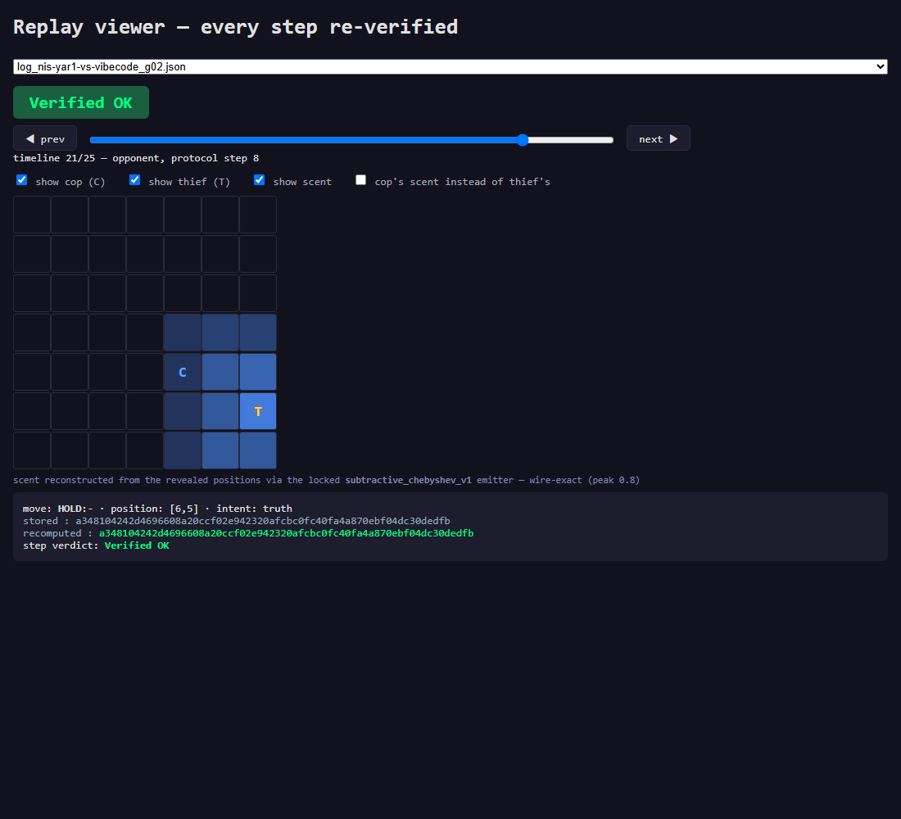

# vibecode-cop — Cop/Thief League Agent (Cop side)

Autonomous cop agent for the university Cop/Thief P2P league. It plays complete
six-sub-game series against remote opponents over the **reference-v3 MCP wire**
(commit-reveal sealed turns, bilateral audit), moves with a **minimax search over
exact scent tracking** with a trained RL fallback, and reports results by Gmail.

Companion repository: [vibecode-thief](https://github.com/AmitKuper/vibecode-thief)
(the thief-side model and mirror implementation). The two repos are operated as one
distributed product; this repo hosts the orchestrator, which spawns **one OS process
per role** (cop and thief) for every series.

**Match record**: seven counted series played (`results/counted_series.json`,
`counted_games_played: 7`) — **won six, lost one**:

| Opponent | Result | Sub-games | Date |
|---|---|---|---|
| `anrbj666` | **lost 35–75** (previous pure-RL engine) | 1–5 | 2026-08-08 |
| `imreeyal` | **won 90–30** | 6–0 | 2026-08-10 |
| `uoh-sqak` | **won 90–30** | 6–0 | 2026-08-11 |
| `rstabcde` | **won 90–30** | 6–0 | 2026-08-14 |
| `najamjad` | **won 90–30** | 6–0 | 2026-08-14 |
| `nis-yar1` | **won 90–30** | 6–0 | 2026-08-16 |
| `bestteam` | **won 90–30** | 6–0 | 2026-08-19 |

Every series settled 6/6 mutual audits *Verified OK* with a confirmed mutual-agreement
hash; per-series evidence is in `evidence/game_vs_<opponent>/`.

## Prerequisites

- **Python 3.13** (pinned in `.python-version`; `pyproject.toml` requires >= 3.12)
- **[uv](https://docs.astral.sh/uv/)** — package and environment manager
- The unmodified league interop kit cloned as a **sibling** of this repo:
  `../external/copthief-league-protocol`
- Optional: a local [Ollama](https://ollama.com) with `llama3.1:8b` for
  LLM-generated hint text (templates are the automatic fallback — nothing breaks
  without it)

## Installation

### Windows (primary development platform)

```powershell
# 1. Install uv
powershell -ExecutionPolicy ByPass -c "irm https://astral.sh/uv/install.ps1 | iex"

# 2. Clone this repo and the league kit side by side
git clone https://github.com/AmitKuper/vibecode-cop
mkdir external
git clone https://github.com/Imreec/copthief-league-protocol external/copthief-league-protocol

# 3. Install dependencies (uv installs the pinned Python automatically)
cd vibecode-cop
uv sync --frozen
```

### macOS / Linux

Identical flow; only the uv installer differs:

```bash
curl -LsSf https://astral.sh/uv/install.sh | sh
git clone https://github.com/AmitKuper/vibecode-cop
mkdir external && git clone https://github.com/Imreec/copthief-league-protocol external/copthief-league-protocol
cd vibecode-cop && uv sync --frozen
```

### Verify the install

```bash
uv run pytest tests/ cop_worker/tests/ league_manager/tests/ -q
```

Expected: **1,942 passed, 4 skipped** (the same suite CI gates, with branch coverage
>= 94%).

## Quick start — self-test against the bundled sparring peer

No network or opponent needed; this plays our agent against the league kit's own
sparring peer over real local HTTP:

```bash
python scripts/live_match_ref3.py --self-test --role thief --sub-games 2
```

Swap `--role police` to exercise the cop side. Each sub-game ends with a mutual
commit-reveal audit; the run prints the per-sub-game outcome and audit verdict.

## Usage

### Playing a live match

```bash
# Friendly series against a saved opponent profile
python scripts/live_match_ref3.py --match --config imreeyal

# Counted series: the lecturer/league address is passed BY HAND, never stored
python scripts/live_match_ref3.py --match --config imreeyal --counted \
    --report-to <league-address>
```

What `--match` does, end to end:

1. Spawns **one OS process per role** (`scripts/ref3_role_worker.py`, driven by
   `scripts/ref3_match/series_split.py`), each binding its own MCP endpoint —
   **cop on port 61224, thief on port 61223** (static public IP, router
   port-forwarded; no tunnel). The two role processes share no memory; the
   orchestrator talks to them over JSON-line pipes and owns no game secrets.
2. Dials the opponent's endpoints per sub-game (our cop dials their thief and
   vice versa), with per-call 10 s caps and at-least-once retries.
3. Plays exactly **six sub-games** over the reference-v3 wire: signed Step-0
   negotiation, thief-first sealed turns (commit-reveal), mutual audit,
   settlement.
4. Writes four artifact kinds per series: per-sub-game `config_*` and `log_*`,
   plus one `declaration_*` and one `result_*` (league schema, `artifacts/`),
   and a timestamped match log under `reports/ref3_matches/`.
5. Emails the result. Friendly default: **our own inbox**. Counted: the address
   given via `--report-to` — it is never stored in any config file
   (enforced by `tests/test_config_single_source.py::test_runtime_toml_has_no_league_address`).

Useful flags: `--arch {split,inline}` (default **split** — one OS process per role;
`inline` is the legacy single-process runtime), `--role`, `--sub-games`,
`--scent-model`, `--move-policy {rl,hybrid_search,hybrid_search_belief}`
(plain RL / minimax-over-exact-tracking with RL fallback / the same plus
belief-space search when no oracle fix is available), `--no-email`,
`--opp-cop-url`/`--opp-thief-url` (override the profile), `--counted-played`.

### Checking match status

The workspace ships a Claude Code skill, `../.claude/skills/game-status`, that parses
`reports/ref3_matches/match_*.log` and the artifacts and answers "did the game
start / who is winning / was the report sent". Manually, the same information is
in `reports/ref3_matches/last_match_result.json` and `artifacts/`.

### Arena and evaluation scripts

```bash
# Search engine vs trained checkpoints (promotion evidence for hybrid_search)
python scripts/arena_search_eval.py --games 20 --cop search --thief search --depth 3

# Adversarial archetype sweep (wall-cutter cop, parity dodger, claim-fork cop)
python scripts/arena_archetypes.py

# Champion evaluation harness
python scripts/eval_candidate.py --help
```

## Configuration

Full details in [`config/README.md`](config/README.md). The one distinction that
matters:

| File | Role | Hashed/shared? |
|---|---|---|
| `config/game.json` | **Shared constitution** — every game rule (board, scent physics, scoring, movement, league terms). Its whole-file canonical SHA (`config_sha256`) and the derived `game_uid` are exchanged with the opponent and must match. | Yes |
| `config/runtime.toml` | **Private operations** — network endpoints/ports, timeouts, LLM settings, identity, report recipient. Changes how we run, never the rules. | Never |

### Opponent profiles

`config/opponents/<group>/{game.json, runtime.toml}` — selected with
`--config <group>`, falling back to the base `config/` if no profile exists.
After each match the effective config is saved back to the profile. CLI flags
always override profile values.

### Scent model per pairing

The negotiated scent law is set per opponent in
`config/opponents/<opp>/runtime.toml` under `[protocol] scent_model`
(or `--scent-model`); the base `config/runtime.toml` carries the same
`[protocol]` block (`scent_model = "subtractive_chebyshev_v1"`,
`move_policy = "hybrid_search"`) so a profile-less run uses the pairing
defaults we actually play on. Two registered models, each with a locked doc hash
(`cop_worker/protocol/reference_v3/constants.py::SCENT_LOCKS`):

- `multiplicative_book_v1` (`934c220d…`)
- `subtractive_chebyshev_v1` (`81ebee59…`) — used vs imreeyal; makes the
  transmitted frame a position oracle (see `docs/PRD_search_engine.md`)

### Environment switches (training/serving observation modes)

Defined in `cop_worker/rl/obs_mode.py`; all default OFF:

| Variable | Effect |
|---|---|
| `COPTHIEF_SCENT_MODEL` | Which scent physics our emission/training uses (`book`/`chebyshev` shorthands accepted) |
| `COPTHIEF_UNIFORM_BELIEF=1` | Train with the frozen uniform belief production actually feeds |
| `COPTHIEF_WIRE_SCENT=1` | Train with the clamped wire scent law instead of the unclamped trainer field |
| `COPTHIEF_DECODED_SCENT=1` | Invert the clamped wire law into an emitter posterior (requires wire scent) |

A serving guard (`cop_worker/rl/counted_policy.py`) compares these against the
promoted model's `obs_mode` block in `models/MANIFEST.json` and **refuses to load**
on mismatch — a checkpoint can never be served under physics it was not trained on.

## Architecture



Design authority: [`docs/DESIGN.md`](docs/DESIGN.md) (C4 diagrams, sub-game
sequence, numbered architecture decisions).

Hardware disclosure: [`docs/HARDWARE_STATEMENT.md`](docs/HARDWARE_STATEMENT.md) —
we played seven counted games and the dev machine's GPU was used in none of
them; all production paths are
CPU-pinned, and measured decision latency (p99 ≈ 1.2 ms vs the signed 30 s
window) shows the hardware spec conferred no competitive advantage.

### Match visuals

Rendered from a real rule-46/47 game between the shipped `hybrid_search` policies
(regenerate with `uv sync --extra viz && uv run python scripts/render_match_visuals.py`
- matplotlib is an optional `viz` extra, not a runtime dependency):

| Trajectory | Chebyshev scent (wire snapshot) | Search territory eval |
|---|---|---|
|  |  |  |

## Game-rules enforcement

All game physics lives in **one pure function**:
`apply_joint_action()` in [`cop_worker/domain/transition.py`](cop_worker/domain/transition.py).
It takes an immutable `DomainState` plus both committed actions and returns a new
state with the outcome — no side effects, no hidden inputs. The thief repo carries
a byte-identical mirror (`thief_worker/domain/transition.py`); cross-repo
conformance tests pin that identical inputs produce identical outputs on both peers.

What it enforces, clause by clause:

- **Board mechanics.** Grid of `grid_size >= 7` (default 7×7), cop start `(0,0)`,
  thief start `(3,3)`. A destination is legal only if it is in bounds and not a
  barrier cell (`_is_valid`). Illegal moves never crash a game: the mover stays in
  place and the step is flagged `*_action_legal = False` in the `TransitionResult`.
- **Orthogonal movement.** Exactly `NORTH/SOUTH/EAST/WEST/STAY` (aliases `N/S/E/W`
  accepted from the wire); no diagonals exist in the delta table. Both moves are
  applied simultaneously to the pre-step state.
- **Barriers (quota 14, rules 46/47).** Only the cop places barriers, via
  `PLACE_N/S/E/W` onto an adjacent cell. The quota is tracked as
  `cop_barriers_remaining`; placement with an empty quota, out of bounds, or onto
  an existing barrier is refused. Rule 46: a barrier placed **onto the thief's
  cell** is an immediate capture. Rule 47 edge case: a barrier placed
  simultaneously with a thief move into that same cell deterministically blocks
  the (already committed, then-legal) move without branding it a violation.
- **Capture and survival.** Cop wins by position overlap, by the thief standing on
  a barrier cell, or by trapping (thief has no orthogonal escape; STAY does not
  count as an escape). Thief wins by surviving to `survival_threshold` turns
  (minimum 35).
- **Scoring (20/5/10/5, tie 2).** Capture: cop 20 / thief 5. Survival: thief 10 /
  cop 5. Tie: 2 points each. These are Appendix-F fixed values enforced by
  [`cop_worker/domain/config_validator.py`](cop_worker/domain/config_validator.py),
  whose pydantic validator **rejects any config** where `max_barriers != 14`,
  scoring differs from 20/5/10/5, or `survival_threshold < 35` — a non-conforming
  `game.json` cannot even be loaded. Each `TransitionResult` carries the
  `cop_score`/`thief_score` awarded by the clause that ended the sub-game.

Two runtime layers wrap the transition. [`cop_worker/rules_engine.py`](cop_worker/rules_engine.py)
(`RulesEngine`) validates per-role move legality against the live board and owns
the **mandatory scent law** (5×5 radial kernel, per-turn decay 0.9, clamp to 0.9 —
the kit's receiver checks every transmitted frame against this law with zero
tolerance). [`cop_worker/gamelet.py`](cop_worker/gamelet.py) (with its
`gamelet_moves/gamelet_events/gamelet_obs/gamelet_results` mixins) coordinates one
sub-game's lifecycle: it refuses to start on invalid negotiated terms
(`parameter_registry.validate_terms`), drives the state machine
(`NEGOTIATING → LOCKED → PLAYING → … → SETTLED`), and accumulates the audit records.

## Protocol — reference-v3

The production wire is the `copthief-league-reference-v3` dialect, implemented in
[`cop_worker/protocol/reference_v3/`](cop_worker/protocol/reference_v3/) and pinned
against the kit's frozen test vectors (`vectors.py` fails closed at startup if this
interpreter cannot reproduce them).

**Four MCP tools** carry an entire series
(`cop_worker/protocol/reference_v3/constants.py::REFERENCE_V3_TOOLS`):

| Tool | Purpose |
|---|---|
| `negotiate` | Step-0: signed terms, scent/wire locks, `game_uid` agreement |
| `receive_turn` | One sealed turn per step (commit + hint + scent frame) |
| `submit_audit` | End-of-sub-game reveal of the full sealed record list |
| `receive_control` | Control signals (settlement, aborts, claims resolution) |

**Commit-reveal.** Every turn is sealed before it is played:

```text
commit = SHA256( canonical_json(payload) + "|" + nonce )
```

where `canonical_json` is the kit's canonical form (compact separators, sorted
keys, native UTF-8 — `hashing.py`) and the payload has exactly the fields
`step`, `role`, `sub_game`, `position`, `move`, `intent`. The wire turn carries
only the **hash** plus the public envelope (`step`, `sender`, `hint`,
`smell_grid`, timestamp, claims) — the nonce and payload stay private until the
audit (`turns.py`: *"the nonce never enters the wire turn"*), so neither side can
adapt its move to the opponent's, and neither can later claim to have played a
different move.

**Mutual audit.** After the last step both sides exchange their complete record
lists (`payload + nonce + commit` per step) via `submit_audit`. Our verifier
(`turns.py::verify_audit`) rehashes **every** record, binds each played step's
received commitment to its reveal, and rejects equivocation (the same step
revealed under two different commitments). Only a bilateral *Verified OK* settles
the sub-game; the same records are what the artifacts publish.

**Offline replay verification.** [`scripts/replay_viewer.py`](scripts/replay_viewer.py)
re-audits any published `log_*.json` after the fact — it verifies file integrity,
rehashes every sealed record on **both** sides (`records` + `opponent_records`),
handles both log formats (internal gamelet `h_commit` logs and production
reference-v3 wire logs), prints `=== VERIFIED OK ===` per log, and exits non-zero
on any mismatch. Run against the real counted-series evidence in this repo
(full capture in [`assets/screenshots/replay_verified_ok.txt`](assets/screenshots/replay_verified_ok.txt)):

```text
$ uv run python scripts/replay_viewer.py evidence/game_vs_uoh-sqak

Auditing log_uoh-sqak-vs-vibecode_g02.json...
  Integrity:   OK  (sha256: 70ce986c11f4...)
  Commitments: OK  (30/30 verified)
=== VERIFIED OK ===

Auditing log_uoh-sqak-vs-vibecode_g04.json...
  Integrity:   OK  (sha256: 562ad6e43061...)
  Commitments: OK  (30/30 verified)
=== VERIFIED OK ===

Auditing log_uoh-sqak-vs-vibecode_g06.json...
  Integrity:   OK  (sha256: 4118e7c39988...)
  Commitments: OK  (30/30 verified)
=== VERIFIED OK ===
```

## Academic report

### The chosen Dec-POMDP model

The match is modeled as a two-agent decentralized POMDP. Hidden joint state:
both positions, the public barrier set, and the step counter. Each side's
**observation is strictly local** — own position, the public barrier list, the
opponent's transmitted chebyshev scent field, and a free-language hint that may
lie; the opponent's position is never observable during play
(`cop_worker/observation.py` has no such field by design). Actions are the four
orthogonal moves + stay, plus barrier placement for the cop; rewards follow the
Appendix-F scoring table. Uncertainty is carried as a belief over the opponent's
cell (`BeliefState`); in production the scent field itself is the operative
position estimate — its unique post-decay peak drives the sighted minimax
frames. Full information model: [`docs/DEC_POMDP_INFORMATION_MODEL.md`](docs/DEC_POMDP_INFORMATION_MODEL.md).

### FastMCP orchestration dilemmas

The four MCP tools are **non-blocking receivers** while a game is a blocking
turn loop — resolved with inbound deques polled under explicit deadlines, never
callbacks into game logic. Per-sender turn numbering means "the opponent's turn
for round r" is r-1 when we move first — an off-by-one that plays blind if
ignored. One physical door per role serves six windows, so sessions reset
per-window (seals, inboxes, wire captures) and an expected-sender guard discards
late turns from the previous window; eager peers that greet the wrong door
early are held until their window's handshake. Everything inbound crosses a
trust boundary: an `InboundGuard` rate-limits every tool, and nothing an
opponent sends is believed until the commit-reveal audit verifies it.

### Strategies, learning curves, and mandatory screenshots

Movement is algorithmic (course rule): a depth-limited minimax with
territory evaluation plays sighted frames; a trained RecurrentA2C-GRU net
covers blind frames; the LLM layer only writes hint text (template mode in
counted play). RL **was** used — the from-scratch chebyshev training run
(12 generations per role, held-out eval each generation):



The cop's resumed generations regressed monotonically (fresh gen01 was the
best cop of the run) — the negative result that moved promotion to the honest
fixed-start harness (`docs/RL_RESEARCH_REPORT_20260810.md`).

| Live GUI — belief map (real counted game) | Replay App — Verified OK |
|---|---|
|  |  |

## Strategy

High level only (the repo's public design docs carry the details):

- **Cop — search over exact tracking.** When the negotiated scent law makes the
  transmitted frame informative enough to localise the opponent
  (`cop_worker/rl/chebyshev_tracker.py`), the cop plays a depth-limited **minimax
  with territory evaluation** (`cop_worker/rl/pursuit_search.py`) over that fix —
  including barrier placement as ordinary search actions under the quota.
- **Trained RL fallback.** For blind frames (no usable fix) the serving adapter
  (`cop_worker/rl/search_policy.py`) falls back to the manifest-pinned trained
  recurrent policy. The obs-mode serving guard guarantees a checkpoint is never
  served under physics it was not trained on.
- **Thief — survival play.** The thief side (companion repo) plays to survive its
  35-round windows: the same search engine evaluates escape territory instead of
  pursuit, with the trained thief net as its blind-frame fallback.
- **Belief and hints.** Both roles observe only `LocalObservation` + `BeliefState`
  (`cop_worker/observation.py` — no hidden coordinates ever enter a policy), and
  exchange free-language hints each turn: a deception policy chooses a
  truth/lie intent, and the text comes from templates or a local LLM
  (`cop_worker/language/`).

## Module reference

| Path | Purpose |
|---|---|
| `scripts/live_match_ref3.py` | CLI entry point and public facade (self-test + live match); implementation lives in `scripts/ref3_match/` |
| `scripts/ref3_match/series_split.py` | Split-architecture series loop: spawns one role worker per role, drives all six sub-games |
| `scripts/ref3_role_worker.py` | Launcher for one role-worker OS process (cop **or** thief) |
| `scripts/ref3_artifacts.py` | League-schema artifact emission, `config_sha256` |
| `cop_worker/protocol/reference_v3/` | Reference-v3 wire: canonical JSON, commits, terms, locks, session |
| `cop_worker/protocol/protocol_agent.py` | Pre-game LLM protocol-understanding agent (never in-game) |
| `cop_worker/rl/pursuit_search.py` | Depth-limited minimax with territory evaluation (both roles) |
| `cop_worker/rl/search_policy.py` | Serving adapter: minimax first, RL fallback |
| `cop_worker/rl/chebyshev_tracker.py` | Exact opponent cell from a chebyshev frame (0.8-peak oracle) |
| `cop_worker/scent_chebyshev.py` | Byte-exact `subtractive_chebyshev_v1` emission/decay/trail |
| `cop_worker/rl/counted_policy.py` | Champion loader + obs-mode serving guard |
| `cop_worker/rl/obs_mode.py` | The `COPTHIEF_*` observation-mode switches |
| `cop_worker/observation.py` | `LocalObservation` / `BeliefState` (no hidden coordinates) |
| `cop_worker/language/` | Hint generation: deception policy, LLM hints, templates |
| `cop_worker/gmail/gatekeeper.py` | Rate-limited, circuit-broken Gmail send pipeline |
| `league_manager/` | Routing facade: router, series lifecycle, ledger, admin API, Gmail gatekeeper |
| `models/MANIFEST.json` | Promoted champion registry (SHA-pinned, obs-mode-stamped) |

### Promoted cop champion

`models/MANIFEST.json` pins one cop model: **`cop_chebyshev_champion.pt`**
(RecurrentA2C-GRU, hidden size 128, 21,000 training steps, sha
`a59e0a6c…`, obs-mode `subtractive_chebyshev_v1` + uniform belief).

Its recorded `evaluation_win_rate` is **0.9926**, and the manifest states the
caveat itself: that figure is measured **on the fixed-start harness**
(`eval_candidate`, seed 20260810), where 80% of episodes open at the signed
`cop_start`/`thief_start` — not on random starts (0.8704 for the random-start
recipe) and not on the wire. In production this checkpoint serves as the
**blind-frame fallback only**; the minimax engine plays every sighted frame.

## Project structure

```
vibecode-cop/
├── README.md           # the only Markdown file at the root; every other doc lives in docs/
├── scripts/            # orchestrator (ref3_match/), role-worker launcher, arenas, evaluation
├── cop_worker/         # the cop worker: protocol, RL, language, gmail, MCP server
├── league_manager/     # routing facade + reporting
├── cop/                # thin `python -m cop` entry point delegating to cop_worker
├── config/             # game.json (shared) + runtime.toml (private) + opponents/
├── models/             # trained checkpoints + MANIFEST.json
├── tests/              # cross-package suites (plus per-package tests/)
├── conformance/        # cross-repo conformance vectors + test_conformance.py
├── tools/              # submission builder + PDF parser (not part of the runtime)
├── artifacts/          # league-schema per-game outputs
├── results/            # counted-series ledger, declarations, logs, evaluation JSON
├── reports/            # timestamped match logs + result snapshots
├── evidence/           # played-series evidence (do not modify)
└── docs/               # DESIGN, PRDs, PROMPTS, runbooks
```

## Troubleshooting

The full log-signature playbook (what each wire error means and the exact sentence
to send the other team) is [`docs/MATCH_DIAGNOSIS_PLAYBOOK.md`](docs/MATCH_DIAGNOSIS_PLAYBOOK.md).
The rows that matter most:

| Symptom | Meaning / fix |
|---|---|
| Probe answers **406** | Opponent endpoint healthy (MCP refusing a bare GET) — this is the READY state |
| Probe answers **502/530** | Their edge is up but nothing is bound behind it — they must restart their peer/tunnel |
| Port preflight refusal at start | A stray local process holds 61223/61224 — kill it |
| Obs-mode guard refusal at load | `COPTHIEF_*` env contradicts the manifest — fix the env, never override the guard |
| Zero turns after handshake | Opponent posting to the wrong role port: cop turns go to our **thief** endpoint (:61223), thief turns to our **cop** endpoint (:61224) |
| Barriers behaving impossibly | Cell-convention mismatch — wire cells are `[row, col]`, not `[x, y]` |
| `REPORT WITHHELD` | Fewer than 6 settled sub-games — correct behaviour (rule 35), settle the missing windows |

Every match line is wall-clock stamped in `reports/ref3_matches/match_*.log`;
diagnose from `[wire<-]` and `[diag]` lines, not guesswork.

## Contributing

1. Fork, create a feature branch, open a PR.
2. Gates that must pass (same as CI): `uv run ruff check .`,
   `uv run ruff format --check .`, and the full pytest suite with branch
   coverage >= 94% (`--cov-fail-under=94` in `.github/workflows/ci.yml`,
   `fail_under = 94` in `pyproject.toml`).
3. Aspire to <= 150 lines per module (project rule; the eleven remaining oversized
   modules are recorded as an accepted deviation in `docs/KNOWN_DEVIATIONS.md`).
4. Never edit `evidence/`, `config/game.json` hashes, or the external kit.

## Self-grade (code quality)

This grade covers **code quality only** — never league results. Basis, all
reproducible from the repo: 1,946 tests collected (1,942 passed, 4 skipped),
branch coverage **96.18%** (measured 2026-08-19; CI-gated at 94), `ruff check` + `ruff format --check`
gating every commit, and a 150-line-per-module discipline (eleven documented
production exceptions in [`docs/KNOWN_DEVIATIONS.md`](docs/KNOWN_DEVIATIONS.md)).

**Self-grade: 92/100**

| Dimension | Grade | Why |
|---|---|---|
| Correctness | 93 | Physics is one pure conformance-pinned function; kit vectors fail closed; serving guards refuse mismatched checkpoints |
| Tests | 93 | 1,942 passing tests, 96.18% branch coverage, conformance vectors, source-pin tests on the production seams |
| Documentation | 90 | DESIGN/PRDs/runbooks current; deviations documented rather than hidden |
| Architecture | 92 | Single transition source of truth, mixin-decomposed gamelet, ≤150-line modules with 11 justified production exceptions |
| Style | 92 | ruff + format zero-finding CI; docstrings throughout |

What would raise it: eliminating the last seven over-150 modules and lifting the
weakest per-module coverage pockets to the suite average.

## Submission

The graded submission state of this repository is the annotated tag
**`v5.0-submission`** (created at the final commit). The two repositories
cross-link each other — this README links
[vibecode-thief](https://github.com/AmitKuper/vibecode-thief) above, and the
thief README links back here — and are operated as one distributed product.
Interpretation decisions are recorded in
[`docs/KNOWN_DEVIATIONS.md`](docs/KNOWN_DEVIATIONS.md).

## License and credits

MIT — see [`LICENSE`](LICENSE).

- **Authors**: Ron Marom, Amit Kuperminz (group *vibecode*)
- **Course**: AI Agent Orchestration, by Dr. Segal Yoram
- **League interop kit**: [`copthief-league-protocol`](https://github.com/Imreec/copthief-league-protocol)
  by the imreeyal team (used unmodified)
