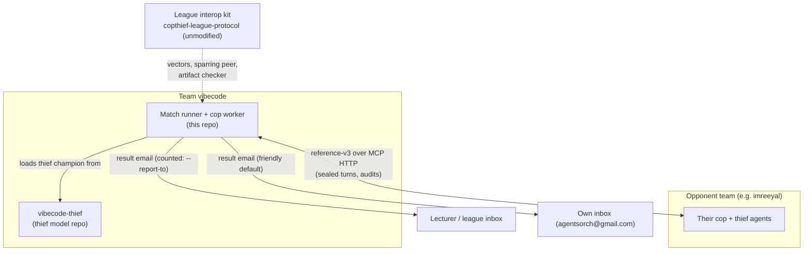
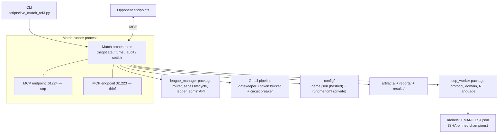
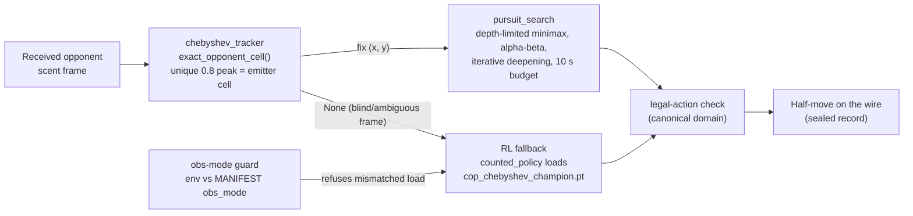

# DESIGN — vibecode-cop architecture authority

Status: current as of the counted win vs imreeyal (2026-08-10, 90–30, 6/6 audits
Verified OK). This document is the architecture reference other docs cite.
Requirements live in `docs/PRD_cop_worker.md`, `docs/PRD_league_manager.md`,
`docs/PRD_search_engine.md`; prompts in `docs/PROMPTS.md`.

## 1. System context

Two student teams play a fully decentralised P2P series — no central referee.
Each side verifies the other cryptographically (commit-reveal + mutual audit) and
both report the settled result independently to the league.



## 2. Containers

One OS process runs a whole series. It serves both of our wire endpoints and
dials the opponent's; packages below it are libraries, not separate services.



Network topology: static public IP with router port-forwarding of 61223/61224 —
deliberately **no tunnel** (see `../docs/ROUTER_PORT_FORWARDING.md`).

## 3. Components — the move-engine stack

Every turn flows through the same stack for both roles:



Files: `cop_worker/rl/chebyshev_tracker.py`, `cop_worker/rl/pursuit_search.py`,
`cop_worker/rl/search_policy.py` (the adapter wiring the three together),
`cop_worker/rl/counted_policy.py` (loader + guard), `cop_worker/scent_chebyshev.py`
(our own byte-exact emission).

## 4. One sub-game (sequence)

```mermaid
sequenceDiagram
    participant Us as Match runner (us)
    participant Opp as Opponent peer
    Us->>Opp: negotiate — signed flat terms (14 keys), scent/wire locks, game_uid
    Opp->>Us: negotiate — their signed greeting (must match: SPAR-N02..N10 refusals)
    loop each round (thief first, max_steps 35)
        Opp->>Us: receive_turn — sealed record (commit, no move revealed)
        Us->>Us: absorb frame -> tracker -> minimax (or RL fallback)
        Us->>Opp: receive_turn — our sealed record (+ free-language hint)
    end
    Note over Us,Opp: terminal — capture (co-location / rule 46) or survival / rule 47
    Us->>Opp: submit_audit — reveal all our records + nonces + result claim
    Opp->>Us: submit_audit — their reveal
    Us->>Us: verify every commit rehashes; corroborate claims; verdict Verified OK / disputed
    Us->>Us: settle — artifacts (config, log), running score, ledger
    Note over Us,Opp: after sub-game 6 — declaration + result artifacts, consensus, Gmail report
```

## 5. Architecture decisions

### AD-1 Single match-runner process serving both endpoints

One process (`scripts/live_match_ref3.py`) binds both MCP endpoints (cop 61224,
thief 61223) and drives all six sub-games.
**Rationale**: one clock, one config load, one artifact writer, one audit trail —
and the roles alternate per sub-game, so a single orchestrator avoids six
process-handoff seams. **Trade-off**: a crash costs the whole series (mitigated:
per-sub-game exception isolation, artifacts flushed as produced). **Alternative
rejected**: separate cop/thief OS processes with a coordinator — the earlier
`agent/`-era design; it doubled the wire-facing surface and made evidence
reconciliation harder without buying isolation the audit does not already give.

### AD-2 Chebyshev lock acceptance and the exact-tracking insight

At Step-0 we accept `subtractive_chebyshev_v1` (locked doc sha `81ebee59…`).
**Rationale**: under that law the transmitted frame's unique 0.8 peak IS the
emitter's current cell (emission merges by max at 0.9, then everything decays
0.1; old peaks are <= 0.7) — the field is a position oracle, so both sides are
effectively sighted and search beats learning (AD-3). A 0.9-peak "fresh deposit"
peer convention resolves to the same argmax. **Trade-off**: our RL nets were
trained under this law too; accepting the *other* pairing's chebyshev proposal is
mandatory anyway once locked hashes match. **Alternative**: insisting on
`multiplicative_book_v1` — measured worse for us (clamped wire field saturates to
a flat 0.9 blanket; the observation goes near-constant by step ~10).

### AD-3 Minimax-over-oracle instead of pure RL for sighted frames

With exact opponent cells, the game is perfect-information pursuit — a search
problem, not a learning problem. **Evidence** (`scripts/arena_search_eval.py`,
jittered starts): search cop depth 3 vs the best RL thieves 12/12 and 12/12
captures; the best RL cop vs the search thief 0/12. **Trade-off**: search costs
CPU per move (bounded, AD-6) and needs an exact fix — hence the hybrid: RL
(`cop_chebyshev_champion.pt`, 0.9926 on the fixed-start harness) serves blind or
ambiguous frames only. **Alternative rejected**: pure RL serving — measured
strictly weaker on both sides of the arena matrix.

### AD-4 Territory evaluation, not plain flood-fill

`pursuit_search.evaluate` scores `-40*dist - 16*territory`, where territory =
cells the thief reaches **strictly before** the cop. **Rationale**: a plain
reachable-region count barely changes as the cop approaches, so horizon-limited
minimax saw every approach as futile and **camped** — observed live in the
2026-08-10 rehearsal (cop parked at (4,4) for 20 turns). Territory strictly
shrinks as the cop closes and only credits walls that cut real escape routes.
**Trade-off**: two BFS maps per leaf; affordable at 49 cells. The 40/16 weights
are measured: distance-dominant weights made the minimising thief prefer a far
corner over the open centre and run into a perimeter sweep (captured in 11
moves, live).

### AD-5 Wire cells are [row, col]; internal state is (x, y)

The kit convention puts `[row, col]` on the wire (same as smell keys `"r,c"`).
We convert at the boundary only (`_to_wire_cell`/`_from_wire_cell` in the match
runner). **Rationale**: found live — sending `[x, y]` transposed every
off-diagonal cell, so barriers registered in the wrong places in the peer's
physics and off-diagonal captures could never settle. **Trade-off**: a permanent
translation seam; pinned by tests so it cannot regress. **Alternative**:
switching internal state to row-major — rejected, it would touch every trained
model's observation layout.

### AD-6 Per-call 10 s cap and at-least-once retries

Every outbound MCP call carries a 10 s deadline and an at-least-once retry
wrapper; the search engine uses the same 10 s figure as its per-move
iterative-deepening budget (a depth is not started unless its predicted ~10x
cost fits). **Rationale**: raw depth-4 measured up to ~74 s in the open midgame
against a 180 s live turn budget; unbounded calls against a flaky tunnel peer
stall a whole window. **Trade-off**: retries require idempotent receivers —
re-sends must carry identical bytes (equivocation is a refusal), which
commit-reveal already enforces.

### AD-7 Own-inbox report default; lecturer address never stored

`cop_worker/gmail/gatekeeper.py` hardcodes `agentsorch@gmail.com` (our own
inbox) as the recipient; a counted run passes the league address by hand via
`--report-to`. `tests/test_config_single_source.py::test_runtime_toml_has_no_league_address`
fails the build if the league address ever appears in runtime config.
**Rationale**: the worst failure mode of an automated reporter is spamming the
lecturer from a test loop; misfires land in our own inbox. **Trade-off**: a
counted run needs one manual argument — accepted as a safety rail.

### AD-8 Obs-mode guard binds environment to manifest

`models/MANIFEST.json` stamps every promoted checkpoint with its `obs_mode`
(scent model, uniform belief, wire/decoded scent). At load,
`cop_worker/rl/counted_policy.py` compares the live `COPTHIEF_*` environment
against that stamp and refuses on mismatch. **Rationale**: we measured large
silent train/serve gaps (e.g. a cop trained on unclamped scent collapsing from
0.96 harness to 0.32 live); a guard converts that class of bug into a loud
startup failure. **Trade-off**: stray env vars block a match start — by design;
the fix is the env, never the guard.

### AD-9 Two-repo duplication (accepted debt)

The course mandates separate cop and thief repositories, and inside this repo
`cop_worker/` and `league_manager/` carry byte-identical copies of some modules
(notably the protocol stack). **Rationale**: repo separation is a course
requirement; the internal copies date from the 3-process restructure and were
kept because deduplication churns the exact code that plays counted games.
**Trade-off**: fixes must be applied twice (drift is caught by mirrored test
suites). **Planned**: extract a shared package after the league window closes —
tracked in `docs/KNOWN_DEVIATIONS.md`, deliberately not before.
